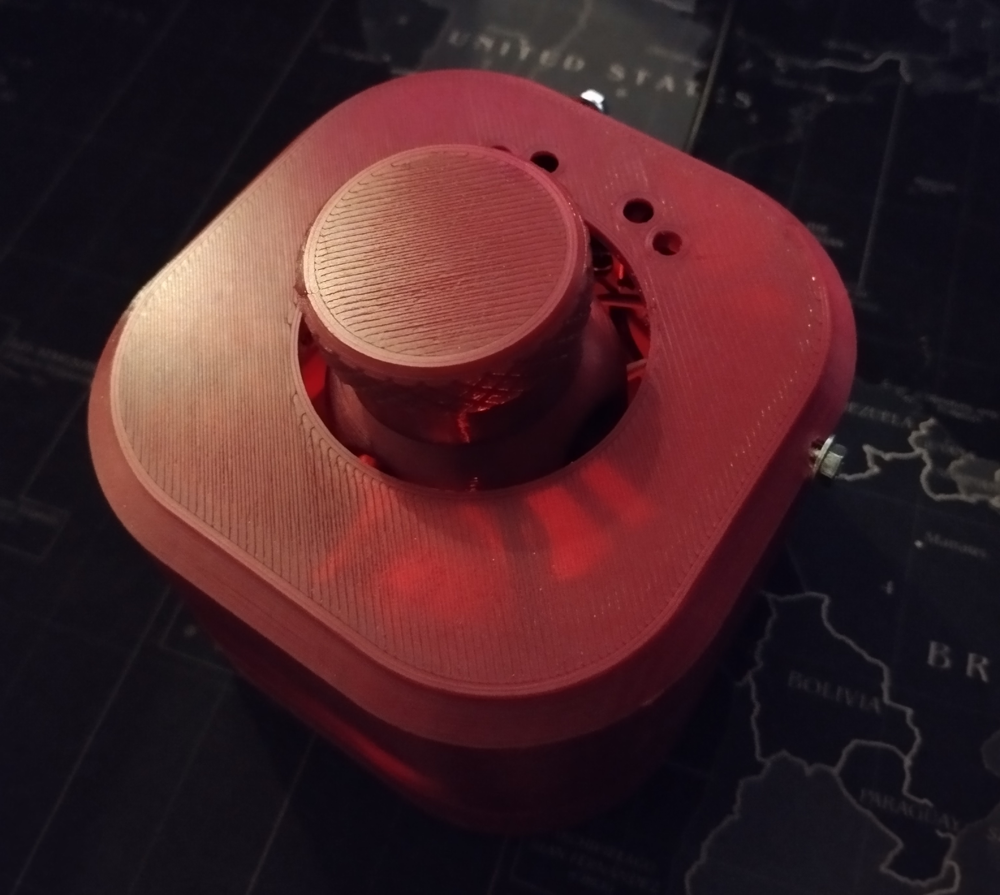

##### The device

If you spend any amount of time in CAD, you may have had stumbled upon a name "Spacemouse". But what is it?
[Spacemouse](https://www.youtube.com/watch?v=ZqTRJ7oTKII) is a 3D (or to use a proper term 6DoF - degrees of freedom) input device for cool kids.

No, seriously. That's it. You absolutely can do CAD work with regular mouse. Spacemouse doesn't add any new feature per se. It doesn't do anything a normal mouse can do. The secret sauce is how effortlessly it combines those features. Working with CAD becomes way more intuitive and faster. 

##### The problem

The issue is that even the cheapest options are not exactly cheap. The simplest model is about 700 PLN in Poland. I felt like I couldn't justify such expense just to use it in hobby applications.

##### The alternatives

One quick Google search later and it turned out that open source community had a lot to say in this topic. There were a couple of projects in various stages of completion. Unfortunatelly, each one of them had something that I considered a dealbreaker. Here's a quick rundown:

- [Open source SpaceMouse](https://www.printables.com/pl/model/864950-open-source-spacemouse-space-mushroom-remix) by TeachingTech  
I think this is the most popular one within the 3D printing community. Partially due to author's popularity (seriously, his work is awesome) and partially due to pretty neat design. I actually made one. 

However, it's not the most ergonomic device (it's pretty large) and it wasn't as precise and smooth as I'd like. First thing could be solved by some tinkering with angles and ergonomic wrist rests, and the second by dialing in the assembly (I hurried it a bit, so that's on me), but I don't want to rely on joysticks as sensors. Still, this project combined some of the great contributions of other authors and added some more, and I'd like to use some of those good ideas - like mimicking the real 3Dconnexion device with ATMega32U4-based board
- [Space Mushroom](https://www.printables.com/en/model/353764-space-mushroom-full-6-dofs-space-mouse/comments/556562) by shiura  
This is one of the contributions that TeachingTech remixed. My points from above still stand - I don't want to rely on joysticks. Besides, from what I've seen in TeachingTech's video when he attempted to create one, figuring out the math of three joysticks was pretty complicated and requires some matrix algebra. Simplifies hardware, but complicates software.
- [OS3M](https://hackaday.io/project/187172-os3m-mouse) by Colton Balridge  
Amazing form factor, and the use of coils built into a custom PCB is really innovative. The thing is, I'm not a fan of custom PCBs. Partially because I don't have any experience with them, partially because delivery to Poland is quite expensive, and partially because they're not janky enough for my liking. Also, this device is tailored to work with SolidWorks. Not universal enough. It could work with any program with a C++ API, but adapting it to my needs (mostly Fusion360) is likely too much hassle (if it's even possible).
- [DIY Space Mouse](https://www.instructables.com/DIY-Space-Mouse-for-Fusion-360-Using-Magnets/) by Salim Benbouz  
I really like the form factor of this device. Also, the use of a magnetometer seems great for tracking translations. Unfortunately, this isn't a 6DoF device, but only two. A magnetometer can track magnetic field changes in three dimensions, which is already less than needed. But it might be a good starting point, since it would allow tracking 3 degrees of freedom (translations)
- [Nebula Spacemouse](https://www.youtube.com/watch?v=UMxeWO_QUHA) by DoTheDIY  
This is by far the best DIY Spacemouse I've seen during my research. Almost identical dimensions to the basic Spacemouse (a big plus for ergonomics) and built-in battery and wireless capabilities—nothing short of amazing. The catch? The design is not published (but it's still possible to deduce some info from the demonstration videos). And my earlier point about PCBs stands.

##### The idea

While gathering all that info, an idea popped into my mind. If none of these designs have everything I want, why not **create** one?
Why? For fun, of course. I really enjoy the challenge. Maybe even a little too much :-D

##### The directives

As with most projects, it's a good idea to set some design directives that give the project structure and prevent digressing too much from the initial purpose. Taking into account all the research above, I came up with following list:

1. No PCBs
2. No joysticks
3. Full 6DoF
4. Mimicking the 3Dconnexion Spacemouse
5. Wired connection over USB-C

Time to tinker away!